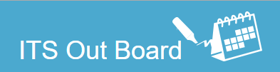

The In/Out board is a project that another student and I are working on for ITS. It is a simple web app that will allow staff of ITS to check to see who is in or out of the office. This project gave me experience with full-stack web application developing. I gained expeirence with many new technologies including, MySql for the database, JavaEE for the server side, AngularJS for the front end, Twitter Bootstrap for styling, and github to manage the project. This project is still in progress, and I am excited to complete it.
