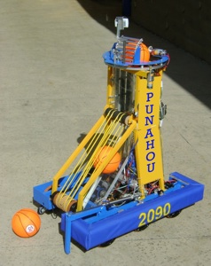

Back in 2012 when I was a senior in high school, I was part of the FIRST robotics team. FIRST robotics hosts a new competition every year, and high schools build robots to try and compete. In 2012 the challenge was something called Rebound Rumble, which was essentially just basketball with a lot of balls. To succeed at this competition a robot needed two thing, a way to collect the balls, and a way to throw them through the hoop.

I was one of only two programmers on the team. Our main jobs were, setting up the remote control system for the robot, and teaching the robot to aim and shoot. The remote control system was pretty straight forward, but teaching the robot to aim and shoot was a big challenge. Robotics was a great experience for me, I learned a lot about working in a large team, and the importance of effective communication between departments.

Read about [FIRST Robotics](http://www.firstinspires.org).
