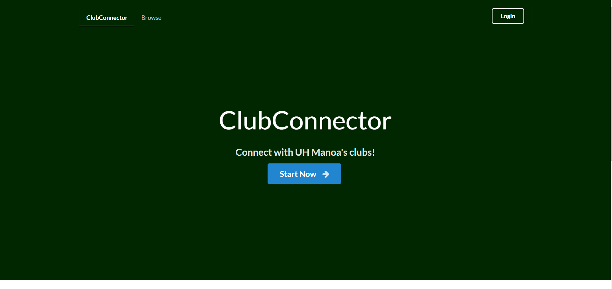

Club Connector is a Meteor web application that me and three other students developed for our software engineering class. Club Connector is a place where University of Hawaii students can go to quickly find clubs based on their interests.

On the main page of the website, each club gets a card with a little bit of information about the club on it. The card also contains a link to the club's profile, where the user can get in-depth information about the organization. The main page also features a search bar, which users can use to find specific clubs. If they don't know exactly what club they are looking for, they can use the sites filter system to do a general search of topics. Once a user logs in, they can save their preferred filters, and their favorite clubs.

For more information please see the [Project Page](https://clubconnector.github.io/)

## My Contribution

My main contribution to the project was the functionality of the browse page. I set up the system that uses information from the search bar, filter bar, and the user's favorites, to create a list of clubs that matches the specifications. I also set up the system for loading and saving default filters.

## What I Learned

This project gave me a lot of experience with JavaScript, Semantic UI, Meteor, and MongoDB. Through this experience, I have learned a lot about how Meteor templates interact with each other, with Semantic elements, and with the underlying Mongo database. I also got to practice using GitHub with a larger team than I am used to. We used GitHub's Issue system to track tasks, and we used GitHub's projects to organize those tasks into milestones. Since our team could only meet about once a week, this system was perfect for keeping track of who was doing what, and what needed to be done.
